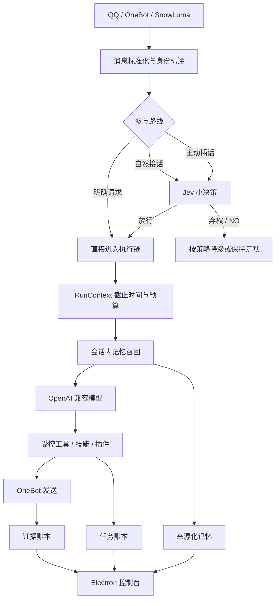

# 37QAG

> 面向 QQ 群聊的本地优先 Agent：将 OneBot 接入、OpenAI 兼容模型、Jev 小决策、来源化记忆、任务闭环、技能与社区插件整合在一个 Electron 桌面应用中。

[](https://nodejs.org/)
[](https://www.electronjs.org/)
[](#检查与测试)
[](LICENSE)

37QAG 以“QQ-Agent-整合版-20260922”为稳定运行基线，整合 Jev 决策树、来源化记忆和任务闭环，并参考“QQ-Agent 0.4 preview”的长期扩展设计。当前版本为 **37QAG 0.6.0**。

---

## 目录

- [项目简介](#项目简介)
- [核心能力](#核心能力)
- [当前技术栈](#当前技术栈)
- [运行流程](#运行流程)
- [系统要求](#系统要求)
- [快速开始](#快速开始)
- [配置说明](#配置说明)
- [启动方式](#启动方式)
- [检查与测试](#检查与测试)
- [项目结构](#项目结构)
- [插件与技能](#插件与技能)
- [记忆与任务状态](#记忆与任务状态)
- [隐私与脱敏](#隐私与脱敏)
- [可选组件](#可选组件)
- [故障排查](#故障排查)
- [已知限制](#已知限制)
- [文档](#文档)
- [版本与许可证](#版本与许可证)

---

## 项目简介

37QAG 是一个可长期运行的 QQ 群 Agent 桌面应用。它不是单一聊天机器人脚本，而是一条完整的运行链路：

1. 从 OneBot / SnowLuma 接收 QQ 消息；
2. 通过参与路线和 Jev 小决策判断本轮是否需要行动；
3. 按当前会话范围召回必要记忆；
4. 调用 OpenAI 兼容模型和受控工具；
5. 通过 OneBot 发送文字、图片、表情或合并转发；
6. 写入来源化证据、会话记忆和任务账本；
7. 在 Electron 控制台中提供配置、日志、插件、记忆、任务和运行状态管理。

37QAG 优先保证“明确请求必须执行、范围不能越权、结果不能无证据地宣称完成”。

## 核心能力

### 请求参与与 Jev 决策

- 用户明确要求回复、发图、查资料时，Jev 的 `NO` 不能否决。
- Jev 只处理小决策：是否插话、是否回忆、是否发图、选择表情等。
- 前置判定有独立预算；超时或迟到结果会被冻结，不会拖慢或改写本轮。
- 图片需求分级：只有模糊、可弃权的图片需求能被 Jev 否决。
- QQ 私聊普通消息按明确参与处理，不因 Jev 故障而丢失。

### 记忆与证据

- `memory_search` 与 `memory_archive` 默认只访问当前会话，不跨群或读取私聊。
- 证据区分明确陈述、平台回执和模型推断；推断只能进入候选。
- 人物活跃时间、事实确认时间和事实读取时间分别记录。
- 更正会生成新版本，删除保留墓碑，不会被模型自动写回成“从未存在”。
- 记忆整理、阅读和人物活跃状态互不刷新确认时间。

### 任务闭环

- `planned`、`submitted`、`platform_confirmed`、`completed` 是不同状态。
- 模型宣称完成不等于任务完成；没有结果证据只能标记为结果不明。
- `send_message` 可携带 `taskId`，将提交状态、平台回执和完成证据分开记录。
- 所有发送动作受本轮截止时间、每轮次数和总发送量限制。

### 工具与安全

- 工具遵循 scope-first：工具参数不能自行扩大可访问的会话范围。
- 每轮、每次运行和发送工具都有独立调用上限。
- 日志会自动脱敏 API Key、令牌和 Cookie。
- 图片预览、私网访问和可浏览域名默认收紧。
- 外部图片不能被识别为机器人本人；模型不能通过图片内容改写身份。

### 桌面与多实例

- Electron 控制台支持配置、日志、模型、记忆、任务、插件、表情和主题管理。
- 支持单账号和双账号运行。
- 双账号使用 `data/` 与 `data-2/` 隔离业务数据，并共享桌面外观偏好。
- 主实例可以拉起无窗口 peer，也可以回退为第二个独立窗口。

### 插件与技能

- 统一接收 `commands`、`intercept`、`settingsUi`、`exposes`、插件存储和核心消息拦截点。
- 插件使用 `plugin.json` + `index.js`，通过 `setup(api)` 接入生命周期、能力、工具和钩子。
- 社区插件兼容层允许不同二开版本的插件在 37QAG 中共存。
- 内置插件热重载会忽略运行数据、日志、媒体和备份目录。

---

## 当前技术栈

| 层级 | 当前技术 | 版本 / 说明 |
| --- | --- | --- |
| 编程语言 | JavaScript | ECMAScript Modules（`"type": "module"`） |
| 运行时 | Node.js | `>=22.12.0`；当前开发环境使用 Node.js 24.20.0 |
| 包管理 | npm | 当前开发环境使用 npm 10.5.0 |
| 桌面壳 | Electron | `^44.4.5`；当前安装版本 44.4.5 |
| 控制台 UI | HTML / CSS / 原生 JavaScript | 无 React、Vue 或前端打包器 |
| 桌面通信 | Electron `ipcMain` / `preload` | 使用 Context Bridge 限制渲染进程能力 |
| HTTP 客户端 | `undici` | `^6.28.0`；当前安装版本 6.28.0 |
| WebSocket | `ws` | `^8.18.0`；当前安装版本 8.21.3 |
| 配置解析 | `js-yaml` | `^5.4.1`；用于供应商配置兼容 |
| QQ 协议接入 | OneBot v11 | WebSocket 接收事件，HTTP API 发送与查询 |
| 协议端 | SnowLuma | 推荐 v1.14.19+；支持旧接口受控回退 |
| 模型接口 | OpenAI 兼容 API | Base URL、模型、API Key 和供应商方言可配置 |
| 本地小决策 | llama.cpp / `llama-server` | 可选；只做窄域标签判定，不负责聊天正文 |
| 本地小模型 | Qwen3.5 0.8B GGUF | 可选；默认使用 Q6_K，视觉可配 mmproj |
| 数据存储 | JSON / NDJSON | 配置、证据账本、任务账本、记忆、日志和使用量记录 |
| 插件模型 | ESM + JSON Manifest | `setup(api)`、工具注册、消息钩子、能力与本地存储 |
| 测试框架 | `node:test` | 配合 `node:assert/strict`，无额外测试框架 |
| 语法检查 | `node --check` | 核心模块、插件入口、Electron 与 UI 脚本 |
| 可选媒体工具 | FFmpeg / ffprobe | 视频合流、转封装和抽帧 |
| 可选语音工具 | whisper.cpp | 本地语音转文字，需要用户准备二进制与模型 |

### npm 依赖

```text
dependencies
  js-yaml   ^5.4.1
  undici    ^6.28.0
  ws        ^8.18.0

devDependencies
  electron  ^44.4.5
```

生成并提交了 `package-lock.json`，用于保持依赖解析结果可复现。

### 依赖安全状态

- `npm audit --omit=dev`：生产依赖 0 个已知漏洞。
- 完整 `npm audit`：0 个已知漏洞；Electron 已升级到 44.4.5，并消除旧 Electron 33.x 开发依赖链中的 2 个高危项。
- Electron 44 要求安装环境使用 Node.js 22.12.0 或更高版本。

---

## 运行流程



关键模块：

- `src/orchestrator.js`：整轮编排、预算、取消和发送收束。
- `src/decision-policy.js`：识别明确请求、自然回复和主动插话。
- `src/run-context.js`：绑定轮次、前置预算、整轮截止时间和取消信号。
- `src/memory-evidence.js`：会话隔离、证据来源和事实时间。
- `src/task-ledger.js`：任务状态、平台回执和完成证据。
- `src/local-jev.js`：本地或云端 Jev 小决策旁路。
- `src/onebot.js`：OneBot v11 事件与 API。
- `src/tools.js` / `src/tool-registry.js`：工具协议、工具注册和调用限制。
- `src/plugin-loader.js`：插件发现、兼容、生命周期和热重载。

---

## 系统要求

### 基础要求

- Windows 10 / 11 x64（当前启动脚本和本地运行链路主要面向 Windows）。
- Node.js 22.12.0 或更高版本（Electron 44 安装链的最低要求）。
- npm 9 或更高版本。
- 可访问 OpenAI 兼容模型 API。
- 一个 OneBot v11 兼容协议端；推荐 SnowLuma v1.14.19 或更高版本。

### 可选要求

- 本地 Jev：`llama-server` 和 Qwen GGUF 模型。
- 视觉本地判定：额外的 mmproj 投影文件。
- 语音转文字：whisper.cpp 的 `whisper-cli` 与 ggml 模型。
- 视频下载、合流或抽帧：FFmpeg / ffprobe。
- 本地 Electron 打包环境如需自行构建安装包，还需要相应平台的 Electron 打包工具。

---

## 快速开始

### 1. 获取项目

```bash
git clone git@github.com:lxQingFeng/37QAG.git
cd 37QAG
```

### 2. 安装依赖

```bash
npm install
```

要求 Node.js ≥ 22.12.0。服务器（无桌面环境）可只装生产依赖后使用 headless 模式。

Electron 42+ 的 npm 安装阶段可能只写入命令入口，首次启动桌面端时再自动下载 Electron 二进制。若希望安装依赖时预先下载，可执行 `npm exec install-electron`。

### 3. 启动（Windows/Linux 双端统一入口）

```bash
node scripts/start.mjs             # 自动：有 Electron 显示环境→桌面端；否则 headless
node scripts/start.mjs --headless  # 服务器模式，浏览器访问 http://localhost:3210
node scripts/start.mjs --desktop   # 桌面模式（等价 npm start）
node scripts/start.mjs --debug     # 前台运行、控制台可见（排错）
```

传统入口同样保留：Windows 双击 `启动-单号.bat` / `启动-双号.bat`；Linux/macOS 运行 `启动-单号.sh` / `启动-双号.sh`（均为 start.mjs 的薄包装）。双号即第二实例：数据目录 `data-2/`、端口自动 +1。

### 4. 完成首次配置

首次启动会生成 `data/config.json`。在控制台中至少配置：

1. 模型 API Base URL；
2. 模型名称；
3. API Key；
4. SnowLuma WebSocket 地址；
5. SnowLuma HTTP API 地址；
6. 访问令牌；
7. 群聊或私聊白名单。

配置完成后重启应用，使模型端和协议端连接稳定。

> 仓库不会提交真实的 `data/config.json`。需要手工预置配置时，可复制根目录的 `config.example.json` 到 `data/config.json`，再填写真实值。

```bash
mkdir -p data && cp config.example.json data/config.json   # Linux/macOS
```

```powershell
New-Item -ItemType Directory -Force data | Out-Null
Copy-Item config.example.json data\config.json
```

---

## 配置说明

配置文件位于：

```text
data/config.json
```

双账号的第二实例使用：

```text
data-2/config.json
```

### 重点配置区域

| 配置块 | 用途 |
| --- | --- |
| `api` | OpenAI 兼容接口、模型、API Key、思考参数、超时、缓存、工具预算 |
| `providers` | 多供应商配置与方言适配 |
| `localJev` | 本地或云端 Jev、模型路径、端口、超时和置信度 |
| `webSearch` | 网页搜索、图片搜索、Wiki、搜索供应商和 API 新闻 |
| `snowluma` | WebSocket、HTTP API、访问令牌、账号白名单 |
| `security` | 私网图片/抓取、图片预览、大小和浏览域名限制 |
| `allow` / `deny` | 群聊与私聊白名单、黑名单 |
| `persona` | 机器人名字、角色卡、参与频率、情绪配置；出厂默认人设为「小鲸鱼」卡（已有配置不迁移） |
| `send` | 消息拆分、发送节奏、频率和长度限制 |
| `store` | 上下文层级、热消息、历史消息和会话文件 |
| `memory` | 记忆整理、语义卡、记忆模型 |
| `skills` | 内置技能和插件开关 |
| `server` | 控制台端口、实例名、访问令牌、自启动 |
| `ui` | 主题、亮度、缩放、导航和视觉面板 |

### 人设与角色卡

- 出厂默认人设为**小鲸鱼**（DeepSeek 娘，混群 AI 群友，与上游源项目一致）；`37` 等其余 4 张内置卡在控制台「设置 → 人设」里随时切换。已存在的用户配置不会被新默认值覆盖。
- 想用自己的角色卡，可直接**导入文件**（`data/personas/` 文件层，放入即生效）：
  - `.txt` / `.md`：整篇正文就是角色卡；人设名取正文首个 `#` 标题（如 `# 角色卡：小白猫` → `小白猫`），没有标题就用文件名；
  - `.json`：`{"id": "...", "name": "...", "text": "角色卡全文"}`（`roleText` 字段名也认）；
  - 也可以在控制台「设置 → 人设 → 导入人设文件」里选文件，效果与把文件放进 `data/personas/` 等价。
- 导入的卡与内置人设走同一条安全链（`sanitizeRoleText` 过滤不可用工具指引），空文件 / 坏 JSON 会自动跳过，不影响运行。
- 删除导入的人设：删掉 `data/personas/` 里对应的文件即可。

### 配置安全建议

- 不要把真实 API Key、访问令牌、Cookie 或 WebUI 密码提交到 Git。
- `data/`、`data-2/`、`desktop-prefs.json`、日志和本地配置均已被 `.gitignore` 排除。
- 控制台访问令牌应使用足够长的随机值。
- 非本机部署时，请不要把控制台端口直接暴露到公网。
- 升级或备份前，单独加密保存 `data/` 与 `data-2/`，不要将它们上传到公共仓库。

---

## 启动方式

### 单账号

```powershell
npm start
```

或：

```powershell
powershell -NoProfile -ExecutionPolicy Bypass -File launch.ps1 -Mode single
```

### 双账号

```powershell
powershell -NoProfile -ExecutionPolicy Bypass -File launch.ps1 -Mode dual
```

双账号模式会：

- 主账号使用 `data/`；
- 第二账号使用 `data-2/`；
- 优先启动一个合并窗口和无窗口 peer；
- peer 未在 12 秒内就绪时回退到第二个窗口；
- 读取两个实例的控制台端口，避免误判重复启动。

### 调试启动

```powershell
.\启动-单号-调试模式.bat
```

调试模式保留可见控制台，并将运行日志写入：

```text
launch-log.txt
```

---

## 检查与测试

### 语法检查

```powershell
npm run check
```

### 自动测试

```powershell
npm test
```

当前测试套件包含 **193 项测试**（31 个测试文件，白名单注册于 `package.json` 的 `scripts.test`，新增测试文件需同步登记），另有 **UI 冒烟 7 项**（`npm run test:ui`，无头浏览器加载 / 页签 / 主题 / 形态 / 设置读写 / 主题导入），覆盖：

- 参与路线与 Jev 否决边界；
- RunContext 预算、截止时间和取消；
- 记忆 scope 隔离和来源化证据；
- 事实确认、读取和活跃时间分离；
- 任务状态与非法跳转；
- 工具调用去重和次数限制；
- 社区插件清单、入口、存储和旧设置兼容；
- SnowLuma / OneBot 合并转发参数；
- 日志脱敏和过滤；
- 插件热重载路径和源码签名；
- 人设、提示词压缩和角色工具同步；
- 表情显示与私聊图片行为；
- skill 工具压缩；
- 技能门控路由（skill.json `gateCategory` 归一化、提示词段与工具同源注入、`jev2` 五分类判定与降级保底）；
- 设置补齐键默认值一致性、api-news 配置读取与语音 tokens 透传回归；
- Electron 44 升级兼容（版本与锁文件、Node 引擎、按需下载检测、`console-message` 双签名、Chromium feature 参数大小写）。

测试只使用临时目录，不应写入真实账号配置或真实聊天数据。

---

## 项目结构

```text
37QAG/
├─ assets/                 # 应用图标等静态资源
├─ docs/                   # 架构、迁移、插件和 SnowLuma 适配文档
├─ electron/               # Electron 主进程和 preload
├─ plugins/                # 插件、兼容补丁和插件文档
├─ skills/                 # 模型技能
├─ src/                    # 核心运行链路
│  ├─ conversation-memory/ # 会话记忆、长期记忆、待办
│  └─ skills/              # 技能清单、配置、注册和能力
├─ test/                   # Node.js 测试
├─ themes/                 # 主题定义与主题格式说明
├─ ui/                     # Electron 控制台 HTML / CSS / JS
├─ config.example.json     # 脱敏配置模板
├─ launch.ps1              # Windows 启动逻辑
├─ package.json
└─ README.md
```

### 未提交到 Git 的本地内容

| 路径 / 类型 | 原因 |
| --- | --- |
| `node_modules/` | npm 安装产物，可通过 `npm install` 重建 |
| `data/`、`data-2/` | 账号配置、聊天、记忆、任务、日志和运行数据 |
| `models/` | GGUF / mmproj 模型体积大且需按模型许可证分发 |
| `runtime/` | 第三方本地运行二进制，需单独准备 |
| `snowluma/` | 第三方协议端和账号运行目录，可能包含登录数据 |
| `desktop-prefs.json` | 本机桌面偏好 |
| `launch-log.txt`、`*.log` | 运行日志 |
| `.env`、密钥文件 | 防止凭证泄漏 |

---

## 插件与技能

### 内置插件

| 插件 | 作用 |
| --- | --- |
| `account-pool` | 多账号池管理 |
| `ban-state` | 禁言状态管理 |
| `command-gateway` | 指令前置、权限、参数和插件兼容补丁 |
| `conversation-memory` | 会话记忆、长期记忆、语义卡和待办 |
| `image-compat` | 图片格式兼容和失败重试 |
| `life-system` | 世界设定、日历、事件和近况 |
| `media-download` | B 站 / 抖音媒体下载与转发 |
| `owner-identity` | 主人身份和专属人设识别 |
| `reply-safety` | 内联工具解析、回复抢救和本地收尾 |
| `sleep-mood` | 睡眠、心情、起床和积压消息处理 |
| `speaker-identity` | 发言人身份标注与 @ 规范化 |
| `speech-to-text` | 本地 whisper.cpp 语音转文字 |
| `sticker-admin` | 表情包浏览、标注、新增和删除 |
| `thinking-adapters` | 模型思考参数方言适配 |
| `video-frames` | FFmpeg 视频抽帧 |

### 内置技能

- `calculator`
- `image-generate`
- `knowledge-memes`
- `memory-recall`
- `random-image`
- `reverse-image`
- `sticker-annotate`
- `text-tools`
- `weather-query`

技能使用 `skill.json` 描述名称、参数、能力和设置，并通过技能桥接到统一工具列表。

---

## 记忆与任务状态

### 证据状态

证据不会把模型推断伪装成平台事实：

- 明确陈述：用户或平台明确给出的事实；
- 平台回执：OneBot / SnowLuma 返回的真实发送或查询证据；
- 模型推断：只能作为候选，不能自动升级为确认事实；
- 更正版本：修改产生新版本；
- 删除墓碑：删除后保留存在过的历史边界。

### 时间字段

- `lastSeenAt`：人物或对象最近活跃时间；
- `lastConfirmedAt`：事实最近被明确确认的时间；
- `lastRetrievedAt`：事实最近被读取的时间；
- 读取记忆不会自动刷新事实确认时间；
- 记忆整理不会伪造人物活跃时间。

### 任务状态

```text
planned
  ↓
submitted
  ↓
platform_confirmed
  ↓
completed
```

允许根据证据进入 `unknown_result` 等状态，但不允许从“模型说完成”直接跳到 `completed`。

---

## 隐私与脱敏

本仓库已经执行以下脱敏处理：

- 不提交真实 `data/config.json` 和 `data-2/config.json`；
- 不提交 API Key、OneBot 访问令牌、Cookie、WebUI 密码或私钥；
- 不提交聊天记录、记忆、人物印象和任务数据；
- 不提交真实 QQ 号、联系人、群号和日志样本；
- 源码注释中的账号、消息 ID、昵称和联系人示例已替换为占位值；
- 示例配置只保留空值或安全占位；
- 日志模块会进一步遮蔽密钥、令牌和 Cookie。

即便如此，公开仓库仍应遵守：

1. 不要将本地 `data/`、`data-2/` 或 SnowLuma 登录目录复制到仓库；
2. 不要把真实聊天截图、日志或配置粘贴到 Issue；
3. 提交前运行敏感信息扫描并检查 Git diff；
4. 如果密钥曾被提交，应立即在服务商处吊销并轮换，不要只依赖删除历史。

---

## 可选组件

### 本地 Jev

默认路径：

```text
runtime/llama/llama-server.exe
models/Qwen3.5-0.8B-Q6_K.gguf
models/mmproj-Qwen3.5-0.8B-BF16.gguf
```

这些文件不在 Git 仓库中。可以：

1. 自行准备兼容的 `llama-server`；
2. 将 GGUF 模型放入 `models/`；
3. 在“设置 → 本地 Jev”中修改模型和运行时路径；
4. 如需视觉判定，再指定 mmproj 文件；
5. 重启本地 Jev 服务。

缺少本地模型不会阻止云端模型主链路运行。

### 语音转文字

需要：

- `whisper-cli` 或兼容 whisper.cpp 可执行文件；
- 一个 ggml 语音模型；
- 在插件设置中填写路径或放入系统 `PATH`。

### 媒体下载和视频抽帧

需要 FFmpeg / ffprobe。B 站 DASH 分轨合流依赖 FFmpeg；缺少 FFmpeg 时可使用低画质单流降级路径。

---

## 故障排查

### `npm start` 找不到 Electron

先确认 Node.js 版本不低于 22.12.0，然后执行：

```powershell
npm install
npm exec install-electron   # 可选：预先下载 Electron 二进制
```

若跳过预下载命令，Electron 42+ 会在首次启动桌面端时自动下载二进制。确认 `node_modules/electron` 已安装后再启动；下载失败时检查网络或 npm/Electron 镜像配置。

### 首次启动没有配置文件

应用会在默认数据目录生成：

```text
data/config.json
```

如果启用了 `QQ_AGENT_DATA_DIR` 或 `QQ_AGENT_PROFILE`，实际路径会相应变化。

### SnowLuma 已启动但收不到消息

检查：

- `snowluma.wsUrl` 是否指向 OneBot WebSocket 事件端口；
- `snowluma.httpUrl` 是否指向 HTTP API 端口，而不是 WebSocket 端口；
- WebSocket 与 HTTP 令牌是否配置正确；
- `allow.groups` / `allow.private` 是否包含目标会话；
- SnowLuma 版本是否为 v1.14.19 或更高。

### 控制台端口被占用

修改：

```text
server.port
```

双账号模式会尝试自动选择不同的 peer 端口，但也需要保证本机防火墙和端口未被其他程序占用。

### 本地 Jev 启动失败

确认：

- `localJev.exePath` 存在；
- `localJev.modelPath` 存在；
- GGUF 与 `llama-server` 版本兼容；
- `localJev.port` 和视觉端口没有冲突；
- Windows Defender 或杀毒软件没有拦截本地可执行文件。

### 模型没有发消息

检查模型是否按工具协议调用 `send_message`，以及：

- 本轮是否已超过整轮截止时间；
- 工具每轮、每运行或总发送次数是否用完；
- 发送节奏是否仍在间隔等待；
- Jev 是否只处理可弃权的主动插话；
- 会话是否在允许范围内。

---

## 已知限制

- Windows 是当前主要测试平台；其他平台的启动脚本和本地二进制需要自行适配。
- 37QAG 尚未直接合并“QQ-Agent 0.4 preview”的社区、评论、市场、下载中心、ZIP 安装器和遥测模块。
- 某些插件依赖第三方网站、外部接口或本地程序，稳定性受外部服务影响。
- 媒体下载、语音转文字、视觉判定和本地 Jev 都是可选能力；缺少依赖时会降级，不应视为核心故障。
- 本地模型只承担窄域小决策，不替代云端聊天模型。
- 插件来自不同维护者，升级前应保留插件数据并重新运行兼容测试。
- GitHub 不适合保存大型模型、协议端运行目录和真实运行数据，因此这些内容需要单独分发。

---

## 文档

- [`docs/37QAG-architecture.md`](docs/37QAG-architecture.md)：整体结构和一轮运行链路。
- [`docs/37QAG-migration.md`](docs/37QAG-migration.md)：来源项目迁移、兼容和暂未合并能力。
- [`docs/37QAG-community-plugins.md`](docs/37QAG-community-plugins.md)：插件安装、兼容适配和启用状态。
- [`docs/37QAG-snowluma-1.14.19.md`](docs/37QAG-snowluma-1.14.19.md)：SnowLuma v1.14.19 接口适配和升级保护。
- [`plugins/command-gateway/README.md`](plugins/command-gateway/README.md)：指令前置与插件钩子。

---

## 版本与许可证

- 当前版本：`0.6.0`
- 版本定义：[`package.json`](package.json)
- 仓库地址：[github.com/lxQingFeng/37QAG](https://github.com/lxQingFeng/37QAG)
- 问题反馈：[GitHub Issues](https://github.com/lxQingFeng/37QAG/issues)
- 许可证：[MIT](LICENSE)

37QAG 基于 QQ-Agent 相关开源运行基线和社区插件继续开发。上游项目、插件作者和第三方组件仍保留其原有署名、许可证与权利；再分发第三方二进制、模型或插件前，请自行核对相应许可证。

---

## 致谢

感谢 QQ-Agent 运行基线、QQ-Agent 0.4 preview、社区插件维护者、OneBot / SnowLuma、llama.cpp、Electron 及相关开源项目。
